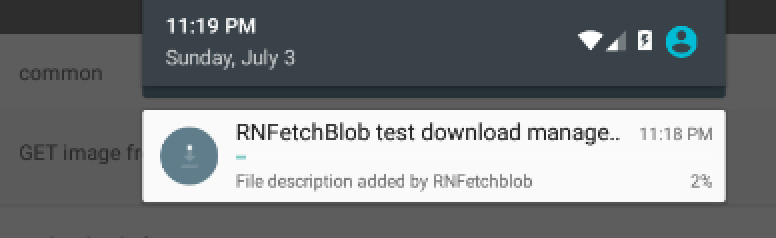
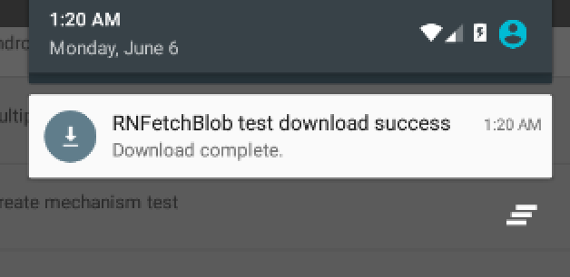
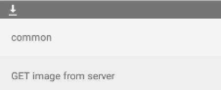
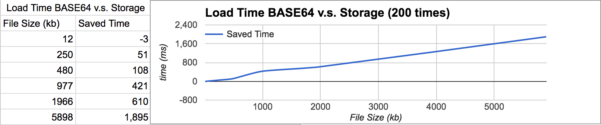
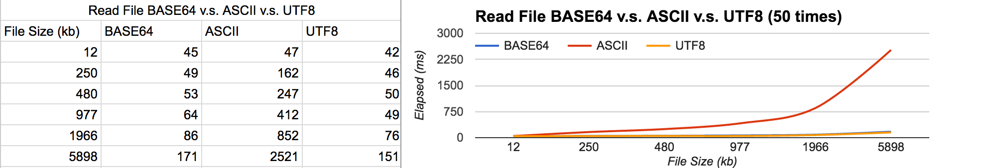
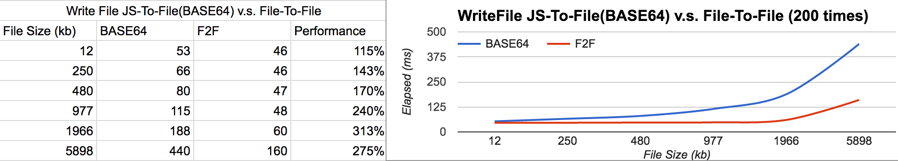

# react-native-fetch-blob
[](https://github.com/wkh237/react-native-fetch-blob/releases) [](https://www.npmjs.com/package/react-native-fetch-blob)  [](https://github.com/wkh237/react-native-fetch-blob/wiki) []()


A project committed to make file acess and data transfer easier, efficient for React Native developers.

> The npm package is inside `src` folder, if you're going to install using github repository do not point to here directly

## Features
- Transfer data directly from/to storage without BASE64 bridging
- File API supports normal files, Asset files, and CameraRoll files
- Native-to-native file manipulation API, reduce JS bridging performance loss
- File stream support for dealing with large file
- Blob, File, XMLHttpRequest polyfills that make browser-based library available in RN (experimental)

## TOC
* [About](#user-content-about)
* [Installation](#user-content-installation)
* [HTTP Data Transfer](#user-content-http-data-transfer)
 * [Regular Request](#user-content-regular-request)
 * [Download file](#user-content-download-example--fetch-files-that-needs-authorization-token)
 * [Upload file](#user-content-upload-example--dropbox-files-upload-api)
 * [Multipart/form upload](#user-content-multipartform-data-example--post-form-data-with-file-and-data)
 * [Upload/Download progress](#user-content-uploaddownload-progress)
 * [Cancel HTTP request](#user-content-cancel-request)
 * [Android Media Scanner, and Download Manager Support](#user-content-android-media-scanner-and-download-manager-support)
 * [Self-Signed SSL Server](#user-content-self-signed-ssl-server)
 * [Transfer Encoding](#user-content-transfer-encoding)
 * [RNFetchBlob as Fetch](#user-content-rnfetchblob-as-fetch)
* [File System](#user-content-file-system)
 * [File access](#user-content-file-access)
 * [File stream](#user-content-file-stream)
 * [Manage cached files](#user-content-cache-file-management)
* [Web API Polyfills](#user-content-web-api-polyfills)
* [Performance Tips](#user-content-performance-tips)
* [API References](https://github.com/wkh237/react-native-fetch-blob/wiki/Fetch-API)
* [Trouble Shooting](https://github.com/wkh237/react-native-fetch-blob/wiki/Trouble-Shooting)
* [Development](#user-content-development)

## About

This project was initially for solving the issue [facebook/react-native#854](https://github.com/facebook/react-native/issues/854), because React Native lack of `Blob` implementation and it will cause some problem when transferring binary data. Now, this project is committed to make file access and transfer more easier, efficient for React Native developers. We've implemented highly customizable filesystem and network module which plays well together. For example, upload and download data directly from/to storage which is much more efficient in some cases(especially for large ones). The file system supports file stream, so you don't have to worry about OOM problem when accessing large files.

In `0.8.0` we introduced experimental Web API polyfills that make it possible to use browser-based libraries in React Native, such as, [FireBase JS SDK](https://github.com/wkh237/rn-firebase-storage-upload-sample)


## Installation

Install package from npm

```sh
npm install --save react-native-fetch-blob
```

Or if using CocoaPods, add the pod to your `Podfile`, for example:

```
pod 'react-native-fetch-blob,
    :path => '../node_modules/react-native-fetch-blob
```

**Automatically Link Native Modules**

For 0.29.2+ projects, simply link native packages via following command because rnpm has been merged into react-native, you no longer need it.

```
react-native link
```

As for projects < 0.29 you need `rnpm` to link native packages

```sh
rnpm link
```

Optionally, use the following command to add Android permissions to `AndroidManifest.xml` automatically

```sh
RNFB_ANDROID_PERMISSIONS=true react-native link
```

pre 0.29 projects 

```sh
RNFB_ANDROID_PERMISSIONS=true rnpm link
```

The link script might not take effect if you have non-default project structure, please visit [the wiki](https://github.com/wkh237/react-native-fetch-blob/wiki/Manually-Link-Package/_edit) to manually link the pacakge.

**Grant Permission to External storage for Android 5.0 or lower**

Mechanism about granting Android permissions has slightly different since Android 6.0 released, please refer to [Official Document](https://developer.android.com/training/permissions/requesting.html).

If you're going to access external storage (say, SD card storage) for `Android 5.0` (or lower) devices, you might have to add the following line to `AndroidManifest.xml`.

```diff
<manifest xmlns:android="http://schemas.android.com/apk/res/android"
    package="com.rnfetchblobtest"
    android:versionCode="1"
    android:versionName="1.0">

    <uses-permission android:name="android.permission.INTERNET" />
    <uses-permission android:name="android.permission.SYSTEM_ALERT_WINDOW"/>
+   <uses-permission android:name="android.permission.READ_EXTERNAL_STORAGE" />                                               
+   <uses-permission android:name="android.permission.WRITE_EXTERNAL_STORAGE" />                                              

    ...

```

Also, if you're going to use `Android Download Manager` you have to add this to `AndroidManifetst.xml`

```diff
    <intent-filter>
            <action android:name="android.intent.action.MAIN" />
            <category android:name="android.intent.category.LAUNCHER" />
+           <action android:name="android.intent.action.DOWNLOAD_COMPLETE"/>                          
    </intent-filter>
```

**Grant Access Permission for Android 6.0**

Beginning in Android 6.0 (API level 23), users grant permissions to apps while the app is running, not when they install the app. So adding permissions in `AndroidManifest.xml` won't work in Android 6.0 devices. To grant permissions in runtime, you might use modules like [react-native-android-permissions](https://github.com/lucasferreira/react-native-android-permissions).

## Usage

ES6

The module uses ES6 style export statement, simply use `import` to load the module.

```js
import RNFetchBlob from 'react-native-fetch-blob'
```

ES5

If you're using ES5 require statement to load the module, please add `default`. See [here](https://github.com/wkh237/react-native-fetch-blob/wiki/Trouble-Shooting#rnfetchblobfetch-is-not-a-function) for more detail.

```
var RNFetchBlob = require('react-native-fetch-blob').default
```

## HTTP Data Transfer


### Regular Request

After `0.8.0` react-native-fetch-blob automatically decide how to send the body by checking its type and `Content-Type` in header. The rule is described in the following diagram


To sum up :

- To send a form data, the `Content-Type` header does not matters. When the body is an `Array` we will set proper content type for you.
- To send binary data, you have two choices, use BASE64 encoded string or path points to a file contains the body.
 - If the `Content-Type` containing substring`;BASE64` or `application/octet` the given body will be considered as a BASE64 encoded data which will be decoded to binary data as the request body.   
 - Otherwise, if a string starts with `RNFetchBlob-file://` (which can simply done by `RNFetchBlob.wrap(PATH_TO_THE_FILE)`), it will try to find the data from the URI string after `RNFetchBlob-file://` and use it as request body. 
- To send the body as-is, simply use a `Content-Type` header not containing `;BASE64` or `application/octet`.

> It is Worth to mentioning that the HTTP request uses cache by default, if you're going to disable it simply add a Cache Control header `'Cache-Control' : 'no-store'` 

> After 0.9.4, we disabled `Chunked` transfer encoding by default, if you're going to use it, you should explicitly set header `Transfer-Encoding` to `Chunked`.

### Download example : Fetch files that needs authorization token

Most simple way is download to memory and stored as BASE64 encoded string, this is handy when the response data is small.

```js

// send http request in a new thread (using native code)
RNFetchBlob.fetch('GET', 'http://www.example.com/images/img1.png', {
    Authorization : 'Bearer access-token...',
    // more headers  ..
  })
  // when response status code is 200
  .then((res) => {
    // the conversion is done in native code
    let base64Str = res.base64()
    // the following conversions are done in js, it's SYNC
    let text = res.text()
    let json = res.json()

  })
  // Status code is not 200
  .catch((errorMessage, statusCode) => {
    // error handling
  })
```

### Download to storage directly

If the response data is large, that would be a bad idea to convert it into BASE64 string. A better solution is streaming the response directly into a file, simply add a `fileCache` option to config, and set it to `true`. This will make incoming response data stored in a temporary path **without** any file extension.

**These files won't be removed automatically, please refer to [Cache File Management](#user-content-cache-file-management)**

```js
RNFetchBlob
  .config({
    // add this option that makes response data to be stored as a file,
    // this is much more performant.
    fileCache : true,
  })
  .fetch('GET', 'http://www.example.com/file/example.zip', {
    some headers ..
  })
  .then((res) => {
    // the temp file path
    console.log('The file saved to ', res.path())
  })
```

**Set Temp File Extension**

Sometimes you might need a file extension for some reason. For example, when using file path as source of `Image` component, the path should end with something like .png or .jpg, you can do this by add `appendExt` option to `config`.

```js
RNFetchBlob
  .config({
    fileCache : true,
    // by adding this option, the temp files will have a file extension
    appendExt : 'png'
  })
  .fetch('GET', 'http://www.example.com/file/example.zip', {
    some headers ..
  })
  .then((res) => {
    // the temp file path with file extension `png`
    console.log('The file saved to ', res.path())
    // Beware that when using a file path as Image source on Android,
    // you must prepend "file://"" before the file path
    imageView = <Image source={{ uri : Platform.OS === 'android' ? 'file://' + res.path()  : '' + res.path() }}/>
  })
```

**Use Specific File Path**

If you prefer a specific path rather than randomly generated one, you can use `path` option. We've added [several  constants](#user-content-dirs) in v0.5.0 which represents commonly used directories.

```js
let dirs = RNFetchBlob.fs.dirs
RNFetchBlob
.config({
  // response data will be saved to this path if it has access right.
  path : dirs.DocumentDir + '/path-to-file.anything'
})
.fetch('GET', 'http://www.example.com/file/example.zip', {
  //some headers ..
})
.then((res) => {
  // the path should be dirs.DocumentDir + 'path-to-file.anything'
  console.log('The file saved to ', res.path())
})
```

**These files won't be removed automatically, please refer to [Cache File Management](#user-content-cache-file-management)**

####  Upload example : Dropbox [files-upload](https://www.dropbox.com/developers/documentation/http/documentation#files-upload) API

`react-native-fetch-blob` will convert the base64 string in `body` to binary format using native API, this process will be  done in a separated thread, so it won't block your GUI.

```js

RNFetchBlob.fetch('POST', 'https://content.dropboxapi.com/2/files/upload', {
    Authorization : "Bearer access-token...",
    'Dropbox-API-Arg': JSON.stringify({
      path : '/img-from-react-native.png',
      mode : 'add',
      autorename : true,
      mute : false
    }),
    'Content-Type' : 'application/octet-stream',
    // here's the body you're going to send, should be a BASE64 encoded string
    // (you can use "base64"(refer to the library 'mathiasbynens/base64') APIs to make one).
    // The data will be converted to "byte array"(say, blob) before request sent.  
  }, base64ImageString)
  .then((res) => {
    console.log(res.text())
  })
  .catch((err) => {
    // error handling ..
  })
```

### Upload a file from storage

If you're going to use a `file` as request body, just wrap the path with `wrap` API.

```js
RNFetchBlob.fetch('POST', 'https://content.dropboxapi.com/2/files/upload', {
    // dropbox upload headers
    Authorization : "Bearer access-token...",
    'Dropbox-API-Arg': JSON.stringify({
      path : '/img-from-react-native.png',
      mode : 'add',
      autorename : true,
      mute : false
    }),
    'Content-Type' : 'application/octet-stream',
    // Change BASE64 encoded data to a file path with prefix `RNFetchBlob-file://`.
    // Or simply wrap the file path with RNFetchBlob.wrap().
  }, RNFetchBlob.wrap(PATH_TO_THE_FILE))
  .then((res) => {
    console.log(res.text())
  })
  .catch((err) => {
    // error handling ..
  })
```

### Multipart/form-data example : Post form data with file and data

In `version >= 0.3.0` you can also post files with form data, just put an array in `body`, with elements have property `name`, `data`, and `filename`(optional).

Elements have property `filename` will be transformed into binary format, otherwise it turns into utf8 string.

```js

  RNFetchBlob.fetch('POST', 'http://www.example.com/upload-form', {
    Authorization : "Bearer access-token",
    otherHeader : "foo",
    'Content-Type' : 'multipart/form-data',
  }, [
    // element with property `filename` will be transformed into `file` in form data
    { name : 'avatar', filename : 'avatar.png', data: binaryDataInBase64},
    // custom content type
    { name : 'avatar-png', filename : 'avatar-png.png', type:'image/png', data: binaryDataInBase64},
    // part file from storage
    { name : 'avatar-foo', filename : 'avatar-foo.png', type:'image/foo', data: RNFetchBlob.wrap(path_to_a_file)},
    // elements without property `filename` will be sent as plain text
    { name : 'name', data : 'user'},
    { name : 'info', data : JSON.stringify({
      mail : 'example@example.com',
      tel : '12345678'
    })},
  ]).then((resp) => {
    // ...
  }).catch((err) => {
    // ...
  })
```

What if you want to append a file to form data ? Just like [upload a file from storage](#user-content-upload-a-file-from-storage) example, wrap `data` by `wrap` API (this feature is only available for `version >= v0.5.0`). On version >= `0.6.2`, it is possible to set custom MIME type when appending file to form data. But keep in mind when the file is large it's likely crash your app. Please consider use other strategy (see [#94](https://github.com/wkh237/react-native-fetch-blob/issues/94)).

```js

  RNFetchBlob.fetch('POST', 'http://www.example.com/upload-form', {
    Authorization : "Bearer access-token",
    otherHeader : "foo",
    // this is required, otherwise it won't be process as a multipart/form-data request
    'Content-Type' : 'multipart/form-data',
  }, [
    // append field data from file path
    {
      name : 'avatar',
      filename : 'avatar.png',
      // Change BASE64 encoded data to a file path with prefix `RNFetchBlob-file://`.
      // Or simply wrap the file path with RNFetchBlob.wrap().
      data: RNFetchBlob.wrap(PATH_TO_THE_FILE)
    },
    {
      name : 'ringtone',
      filename : 'ring.mp3',
      // use custom MIME type
      type : 'application/mp3',
      // upload a file from asset is also possible in version >= 0.6.2
      data : RNFetchBlob.wrap(RNFetchBlob.fs.asset('default-ringtone.mp3'))
    }
    // elements without property `filename` will be sent as plain text
    { name : 'name', data : 'user'},
    { name : 'info', data : JSON.stringify({
      mail : 'example@example.com',
      tel : '12345678'
    })},
  ]).then((resp) => {
    // ...
  }).catch((err) => {
    // ...
  })
```

### Upload/Download progress

In `version >= 0.4.2` it is possible to know the upload/download progress. After `0.7.0` IOS and Android upload progress are also supported.

```js
  RNFetchBlob.fetch('POST', 'http://www.example.com/upload', {
      ... some headers,
      'Content-Type' : 'octet-stream'
    }, base64DataString)
    // listen to upload progress event
    .uploadProgress((written, total) => {
        console.log('uploaded', written / total)
    })
    // listen to download progress event
    .progress((received, total) => {
        console.log('progress', received / total)
    })
    .then((resp) => {
      // ...
    })
    .catch((err) => {
      // ...
    })
```

### Cancel Request

After `0.7.0` it is possible to cancel a HTTP request. When the request cancel, it will definately throws an promise rejection, be sure to catch it.

```js
let task = RNFetchBlob.fetch('GET', 'http://example.com/file/1')

task.then(() => { ... })
    // handle request cancelled rejection
    .catch((err) => {
        console.log(err)
    })
// cancel the request, the callback function is optional
task.cancel((err) => { ... })

```

### RNFetchBlob as Fetch

0.9.0

If you have existing code that uses `whatwg-fetch`(the official **fetch**), you don't have to change them after 0.9.0, just use fetch replacement. The difference between Official fetch and fetch replacement is, official fetch uses [whatwg-fetch](https://github.com/github/fetch) js library which wraps XMLHttpRequest polyfill under the hood it's a great library for web developers, however that does not play very well with RN. Our implementation is simply a wrapper of  RNFetchBlob.fetch and fs APIs, so you can access all the features we provide.

[See document and examples](https://github.com/wkh237/react-native-fetch-blob/wiki/Fetch-API#fetch-replacement)

### Android Media Scanner, and Download Manager Support

If you want to make a file in `External Storage` becomes visible in Picture, Downloads, or other built-in apps, you will have to use `Media Scanner` or `Download Manager`.

**Media Scanner**

Media scanner scan the file and categorize by given MIME type, if MIME type not specified, it will try to resolve the file using its file extension.

```js

RNFetchBlob
    .config({
        // DCIMDir is in external storage
        path : dirs.DCIMDir + '/music.mp3'
    })
    .fetch('GET', 'http://example.com/music.mp3')
    .then((res) => RNFetchBlob.fs.scanFile([ { path : res.path(), mime : 'audio/mpeg' } ]))
    .then(() => {
        // scan file success
    })
    .catch((err) => {
        // scan file error
    })
```

**Download Manager**

When download large files on Android it is recommended to use `Download Manager`, it supports lot of native features like progress bar, and notification, also the download task will be handled by OS, and more effective.



When using DownloadManager, `fileCache` and `path` properties in `config` will not take effect, because Android DownloadManager can only store files to external storage. When download complete, DownloadManager will generate a file path so that you can deal with it.

```js
RNFetchBlob
    .config({
        addAdnroidDownloads : {
            useDownloadManager : true, // <-- this is the only thing required
            // Optional, override notification setting (default to true)
            notification : false,
            // Optional, but recommended since android DownloadManager will fail when
            // the url does not contains a file extension, by default the mime type will be text/plain
            mime : 'text/plain',
            description : 'File downloaded by download manager.'
        }
    })
    .fetch('GET', 'http://example.com/file/somefile')
    .then((resp) => {
      // the path of downloaded file
      resp.path()
    })
```


**Download Notification and Visibiliy in Download App (Android Only)**





If you want to display a notification when file's completely download to storage (as the above), or make the downloaded file visible in "Downloads" app. You have to add some options to `config`.

```js
RNFetchBlob.config({
  fileCache : true,
  // android only options, these options be a no-op on IOS
  addAndroidDownloads : {
    // Show notification when response data transmitted
    notification : true,
    // Title of download notification
    title : 'Great ! Download Success ! :O ',
    // File description (not notification description)
    description : 'An image file.',
    mime : 'image/png',
    // Make the file scannable  by media scanner
    meidaScannable : true,
  }
})
.fetch('GET', 'http://example.com/image1.png')
.then(...)
```

**Open Downloaded File with Intent**

This is a new feature added in `0.9.0`, if you're going to open a file path using official [Linking](https://facebook.github.io/react-native/docs/linking.html) API that might not work as expected, also, if you're going to install an APK in `Downloads` app, that will not work too. As an alternative, you can try `actionViewIntent` API, which will send an ACTION_VIEW intent for you which uses the given `MIME` type.

Download and install an APK programatically

```js

const android = RNFetchBlob.android

RNFetchBlob.config({
    addAndroidDownloads : {
      useDownloadManager : true,
      title : 'awesome.apk',
      description : 'An APK that will be installed',
      mime : 'application/vnd.android.package-archive',
      mediaScannable : true,
      notification : true,
    }
  })
  .fetch('GET', `http://www.example.com/awesome.apk`)
  .then((res) => {
      android.actionViewIntent(res.path(), 'application/vnd.android.package-archive')
  })
```

Or show an image in image viewer

```js
      android.actionViewIntent(PATH_OF_IMG, 'image/png')
```

## File System

### File Access

File access APIs were made when developing `v0.5.0`, which helping us write tests, and was not planned to be a part of this module. However we realized that, it's hard to find a great solution to manage cached files, every one who use this moudle may need these APIs for there cases.

Before start using file APIs, we recommend read [Differences between File Source](https://github.com/wkh237/react-native-fetch-blob/wiki/File-System-Access-API#differences-between-file-source) first.

File Access APIs
- [asset (0.6.2)](https://github.com/wkh237/react-native-fetch-blob/wiki/File-System-Access-API#assetfilenamestringstring)
- [dirs](https://github.com/wkh237/react-native-fetch-blob/wiki/File-System-Access-API#dirs)
- [createFile](https://github.com/wkh237/react-native-fetch-blob/wiki/File-System-Access-API#createfilepath-data-encodingpromise)
- [writeFile (0.6.0)](https://github.com/wkh237/react-native-fetch-blob/wiki/File-System-Access-API#writefilepathstring-contentstring--array-encodingstring-appendbooleanpromise)
- [appendFile (0.6.0) ](https://github.com/wkh237/react-native-fetch-blob/wiki/File-System-Access-API#appendfilepathstring-contentstring--array-encodingstringpromise)
- [readFile (0.6.0)](https://github.com/wkh237/react-native-fetch-blob/wiki/File-System-Access-API#readfilepath-encodingpromise)
- [readStream](https://github.com/wkh237/react-native-fetch-blob/wiki/File-System-Access-API#readstreampath-encoding-buffersizepromise)
- [writeStream](https://github.com/wkh237/react-native-fetch-blob/wiki/File-System-Access-API#writestreampathstring-encodingstring-appendbooleanpromise)
- [unlink](https://github.com/wkh237/react-native-fetch-blob/wiki/File-System-Access-API#unlinkpathstringpromise)
- [mkdir](https://github.com/wkh237/react-native-fetch-blob/wiki/File-System-Access-API#mkdirpathstringpromise)
- [ls](https://github.com/wkh237/react-native-fetch-blob/wiki/File-System-Access-API#lspathstringpromise)
- [mv](https://github.com/wkh237/react-native-fetch-blob/wiki/File-System-Access-API#mvfromstring-tostringpromise)
- [cp](https://github.com/wkh237/react-native-fetch-blob/wiki/File-System-Access-API#cpsrcstring-deststringpromise)
- [exists](https://github.com/wkh237/react-native-fetch-blob/wiki/File-System-Access-API#existspathstringpromise)
- [isDir](https://github.com/wkh237/react-native-fetch-blob/wiki/File-System-Access-API#isdirpathstringpromise)
- [stat](https://github.com/wkh237/react-native-fetch-blob/wiki/File-System-Access-API#statpathstringpromise)
- [lstat](https://github.com/wkh237/react-native-fetch-blob/wiki/File-System-Access-API#lstatpathstringpromise)
- [scanFile (Android only)](https://github.com/wkh237/react-native-fetch-blob/wiki/File-System-Access-API#scanfilepathstringpromise-androi-only)

See [File API](https://github.com/wkh237/react-native-fetch-blob/wiki/File-System-Access-API) for more information

### File Stream

In `v0.5.0` we've added  `writeStream` and `readStream`, which allows your app read/write data from file path. This API creates a file stream, rather than convert whole data into BASE64 encoded string, it's handy when processing **large files**.

When calling `readStream` method, you have to `open` the stream, and start to read data. When the file is large, consider use an appropriate `bufferSize` and `interval` to reduce the native event dispatching overhead (see [Performance Tips](#user-content-performance-tips))

```js
let data = ''
RNFetchBlob.fs.readStream(
    // encoding, should be one of `base64`, `utf8`, `ascii`
    'base64',
    // file path
    PATH_TO_THE_FILE,
    // (optional) buffer size, default to 4096 (4095 for BASE64 encoded data)
    // when reading file in BASE64 encoding, buffer size must be multiples of 3.
    4095)
.then((ifstream) => {
    ifstream.open()
    ifstream.onData((chunk) => {
      // when encoding is `ascii`, chunk will be an array contains numbers
      // otherwise it will be a string
      data += chunk
    })
    ifstream.onError((err) => {
      console.log('oops', err)
    })
    ifstream.onEnd(() => {  
      <Image source={{ uri : 'data:image/png,base64' + data }}
    })
})
```

When use `writeStream`, the stream is also opened immediately, but you have to `write`, and `close` by yourself.

```js
RNFetchBlob.fs.writeStream(
    PATH_TO_FILE,
    // encoding, should be one of `base64`, `utf8`, `ascii`
    'utf8',
    // should data append to existing content ?
    true)
.then((ofstream) => {
    ofstream.write('foo')
    ofstream.write('bar')
    ofstream.close()
})

```

### Cache File Management

When using `fileCache` or `path` options along with `fetch` API, response data will automatically stored into file system. The files will **NOT** removed unless you `unlink` it. There're several ways to remove the files

```js

  // remove file using RNFetchblobResponse.flush() object method
  RNFetchblob.config({
      fileCache : true
    })
    .fetch('GET', 'http://example.com/download/file')
    .then((res) => {
      // remove cached file from storage
      res.flush()
    })

  // remove file by specifying a path
  RNFetchBlob.fs.unlink('some-file-path').then(() => {
    // ...
  })

```

You can also grouping requests by using `session` API, and use `dispose` to remove them all when needed.

```js

  RNFetchblob.config({
    fileCache : true
  })
  .fetch('GET', 'http://example.com/download/file')
  .then((res) => {
    // set session of a response
    res.session('foo')
  })  

  RNFetchblob.config({
    // you can also set session beforehand
    session : 'foo'
    fileCache : true
  })
  .fetch('GET', 'http://example.com/download/file')
  .then((res) => {
    // ...
  })  

  // or put an existing file path to the session
  RNFetchBlob.session('foo').add('some-file-path')
  // remove a file path from the session
  RNFetchBlob.session('foo').remove('some-file-path')
  // list paths of a session
  RNFetchBlob.session('foo').list()
  // remove all files in a session
  RNFetchBlob.session('foo').dispose().then(() => { ... })

```

### Transfer Encoding

After `0.9.4`, the `Chunked` transfer encoding is disabled by default due to some service provoder may not support chunked transfer. To enable it, set `Transfer-Encoding` header to `Chunked`.

```js
RNFetchBlob.fetch('POST', 'http://example.com/upload', { 'Transfer-Encoding' : 'Chunked' }, bodyData)
```

### Self-Signed SSL Server

By default, react-native-fetch-blob does NOT allow connection to unknown certification provider since it's dangerous. If you're going to connect a server with self-signed certification, add `trusty` to `config`. This function is available for version >= `0.5.3`

```js
RNFetchBlob.config({
  trusty : true
})
.then('GET', 'https://mysite.com')
.then((resp) => {
  // ...
})
```

## Web API Polyfills

After `0.8.0` we've made some [Web API polyfills](https://github.com/wkh237/react-native-fetch-blob/wiki/Web-API-Polyfills-(experimental)) that makes some browser-based library available in RN.

- Blob
- XMLHttpRequest (Use our implementation if you're going to use it with Blob)

Here's a [sample app](https://github.com/wkh237/rn-firebase-storage-upload-sample) that uses polyfills to upload files to FireBase.

## Performance Tips

**Read Stream Event Overhead**

When reading data via `fs.readStream` the process seems blocking JS thread when file is large, it's because the default buffer size is quite small (4kb) which result in large amount of events triggered in JS thread, try to increase the buffer size (for example 100kb = 102400) and set a larger interval (which is introduced in 0.9.4 default value is 10ms) to limit the frequency. 

**Reduce RCT Bridge and BASE64 Overhead**

React Native connects JS and Native context by passing JSON around React Native bridge, and there will be an overhead to convert data before they sent to each side. When data is large, this will be quite a performance impact to your app, it's recommended to use file storage instead of BASE64 if possible.The following chart shows how much faster when loading data from storage than BASE64 encoded string on iphone 6.



**ASCII Encoding has /terrible Performance**

Due to the [lack of typed array implementation in JavascriptCore, and limitation of React Native structure](https://github.com/facebook/react-native/issues/1424), to convert data to JS byte array spends lot of time. Use it only when needed, the following chart shows how much time it takes when reading a file with different encoding.



**Concate and Replacing Files**

If you're going to concatenate files, you don't have to read the data to JS context anymore ! In `0.8.0` we introduced new encoding `uri` for writeFile and appendFile API. Which make it possible to done the whole process in native.



## Changes

See [release notes](https://github.com/wkh237/react-native-fetch-blob/releases)

### Development

If you're interested in hacking this module, check our [development guide](https://github.com/wkh237/react-native-fetch-blob/wiki/Home), there might be some helpful information.
Please feel free to make a PR or file an issue.
